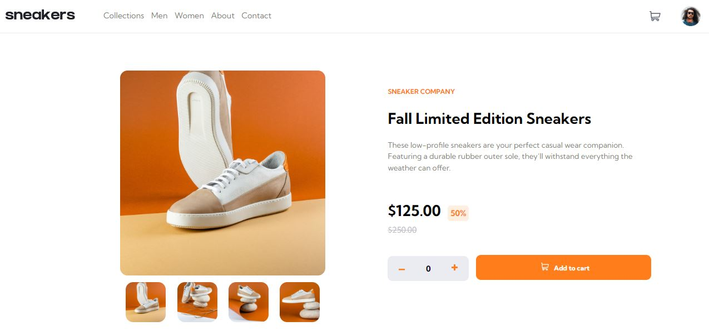
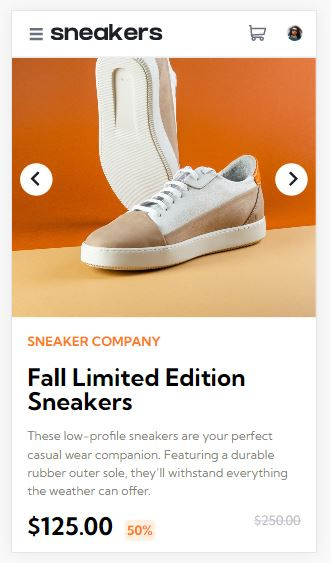

# E-commerce product page

Nesse projeto será desenvolvido a página de um site e-commerce para vendas de tênis. O site terá layout com versão para desktop e também mobile. 

## Menu

- [O Projeto](#o-projeto)
- [Meu Processo](#meu-peocesso)
- [Screenshot](#screenshot)
- [Construido com](#construido-com)

### O Projeto

Nesse projeto temos como proposta criar uma página de um site e-commerce, respeitando as responsividades e o design conforme exemplo. Nesse projeto terei alguns desafios como criar menu hambúrguer, carrossel de imagens e o carrinho dos itens.

### Screenshot

Abaixo estou deixando o screenshot de minha resolução para esse desafio:

Também na versão mobile:

### Link resolução do projeto

No link você será direcionado para o deploy dessa aplicação em funcionamento:

- Gerador de ConcelhosI [Gerador de Concelhos](https://advice-generator-app-main-he4ihxgz8-boarinilucas.vercel.app/)

### Meu Processo

Abaixo o processo para criação do site:

- [X] Desenvolvimento da Navbar Desktop e Mobile.
- [X] Menu hamburguer para mobile.
- [X] Section descrição de produto (Mobile).
- [X] Campos dos valores (Mobile).
- [X] Acertar layout para desktop, espaçamento dos elementos.
- [X] Implementar função para alterar fotos (Desktop).
- [X] Design carrocel para alterar fotos (Desktop).
- [X] Desenvolvimento do pop-up do carrinho (Desktop).
- [X] Adaptando pop-up do carrinho para mobile.
- [X] Implementar função de contagem de itens carrinho.
- [X] Criar funções para controle do carrinho.
- [X] Funcionalidade de troca de imagem (Desktop).
- [X] Funcionalidade de troca de imagem  (Mobile).

### Construido com

As tecnologias utilizadas para esse projeto são as listadas abaixo:

- Semantic HTML5 markup
- CSS custom properties
- JavaScript

## O que aprendi

Nesse projeto tive grandes desafios para a resolução final por conta de se ter várias interações com o usuário a ser construída, como as funções de menu hambúrguer,  carrossel de imagens, como controlar os itens de carrinho entre outras. E isso foi de grande aprendizado na utilização de flexbox, manipulação do DOM, na responsividade.s
